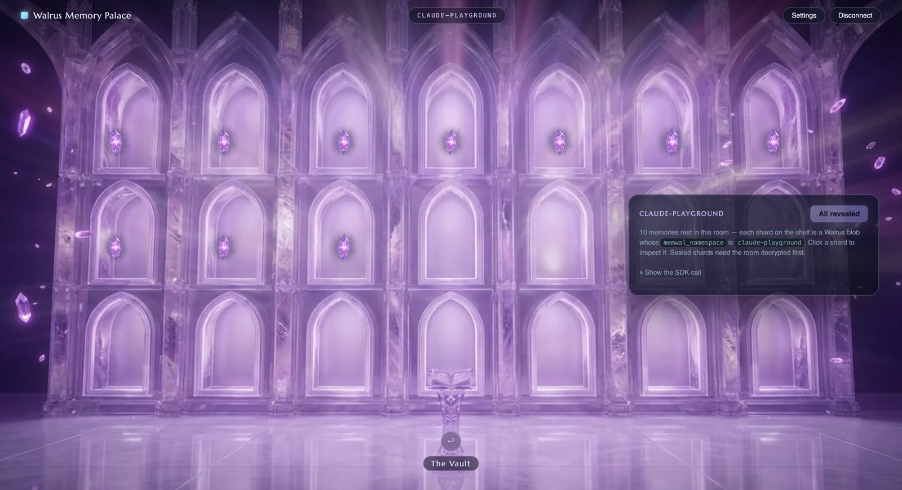

# Walrus Memory Palace


A sample app for the Walrus Memory SDK (`@mysten-incubation/memwal`), built as
a first-person crystal palace you click through, graphic-adventure style.
Every room is a live view over one Walrus Memory account:

| Room | What it shows | SDK / chain surface |
| --- | --- | --- |
| The Gates | connect (one-click or manual) | delegate key registration |
| The Atrium | account overview | `health()` + `MemWalAccount` chain read |
| The Vault | a rotunda — one glowing door per namespace | `listOwnedObjects` + `memwal_*` metadata |
| Namespace rooms | one crystal shard per memory on the shelves | `recall()` join ("Decrypt room") |
| The Observatory | semantic search | `recall()` |
| The Scriptorium | write & maintain | `remember()`, `analyze()`, `restore()` |

Each namespace hashes to one of six generated library variants, so every
namespace room looks different at first sight — a little memory-palace of your
own. Panels carry a "Show the SDK call" snippet with the call they run, so the
palace doubles as a code tour.

| The Vault — one door per namespace | A namespace room — one crystal per memory |
| --- | --- |
|  |  |

## Run it

From the repo root:

```bash
pnpm install
pnpm build:sdk
pnpm --filter @memwal/inspector dev
```

Open http://localhost:5183. No env setup needed: in dev the app proxies
relayer calls through the vite server (deployed relayers CORS-block direct
localhost calls). See `.env.example` for the optional overrides.

## Connect with your own account

- **Manual (works today):** open "Manual setup & advanced options" at the
  Gates and paste a delegate private key + your `MemWalAccount` object ID —
  the same values `MemWal.create()` takes. Get them from the Walrus Memory
  dashboard (https://memory.walrus.xyz) or reuse the ones your MCP login
  saved in `~/.memwal/credentials.json`. Everything stays in your browser's
  localStorage.
- **One-click (needs the dashboard's `/connect/app` route, added in this
  branch — not yet on production `memory.walrus.xyz`):** press "Connect with
  Walrus Memory". A delegate key is generated in your browser and the dashboard
  opens **in a new tab** with the public half; you sign in (zkLogin or a Sui
  wallet) and approve a sponsored `add_delegate_key` (no gas). The dashboard
  sends the popup back to this origin, which signals the palace tab
  (same-origin `BroadcastChannel`) and closes — the gates then recognize you
  and a click plays the entrance. zkLogin, the wallet signature, and the
  sponsor only exist on the dashboard, which is why a dashboard endpoint is
  required. To try it before that route is deployed, run `apps/app` locally and
  set `VITE_MEMWAL_DASHBOARD_URL=http://localhost:5173`.

## Regenerating the artwork

The rooms are AI-generated (Higgsfield). `gen-src/` holds the reproducible
pipeline: `gen-scenes.sh` (prompts) → `gen-rest.sh` (style-locked interiors) →
`gen-rooms.sh` (rotunda + the six library variants) → `to-webp.py` /
`rooms-to-webp.py` (encode into `public/palace/`). `legs.sh` renders the
five-leg camera flight and `encode.sh` encodes it, but only leg 0 ships, as the
`gates.mp4` connect cinematic. Raw outputs are gitignored; the shipped assets
live in `public/palace/`.
